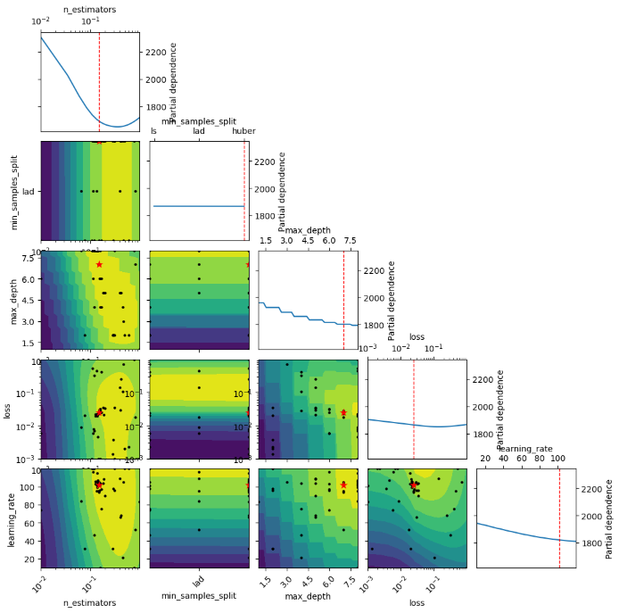
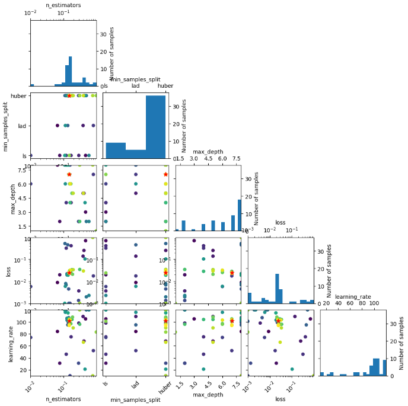

## Airbnb Rent Price Prediction

### Project Overview
* Development of a regression model using a GBM Regressor for predicting Airbnb rent prices in New York city.
* Data analysis, engineering and preparation for model training.
* Hyperparameter Bayesian Optimization.

### Code and Resources Used 
**Python Version:** 3.11.3 (part 1), 3.9 (part 2)  
**Packages:** pandas, numpy, sklearn, matplotlib, seaborn, feature-engine, imblearn, scikit-optimize.

### EDA
* Variables analysis and types categorization
* Missing values, outliers, monotonicity and cardinality analysis
* Variables encoding and imputation
* Outliers filtering

### Model Building and Performance
A Gradient Boosting Regressor model was developed and tuned using Bayesian Optimization with Scikit-Optimize obtaining an RMSE=39.21 in the Test Set.

### Bayesian Optimization Results

Below are notebook captures of our analysis:

### Metric Chosen

RMSE for model results.

---